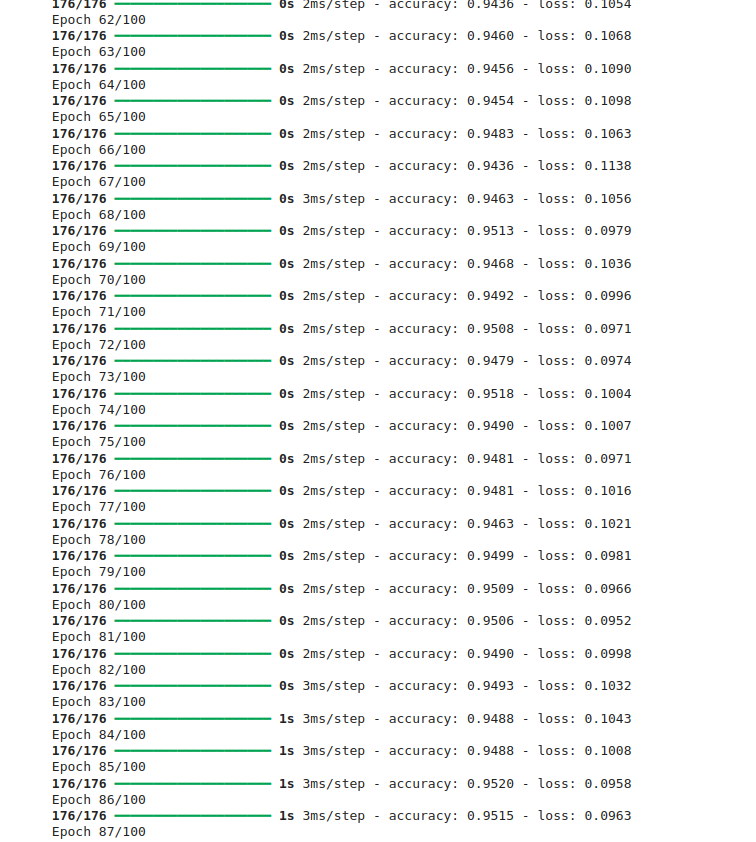

# 📊 Customer Churn Prediction using ANN
## 📊 Model Training Results
## 📊 Model Training Results


## 🚀 Project Overview

This project uses an Artificial Neural Network (ANN) to predict whether a customer will churn (leave a service) or not based on customer data.

The model is trained on a telecom dataset and learns patterns such as tenure, services, and billing behavior to make predictions.

---

## 🧠 Model Architecture

* Input Layer: 26 features
* Hidden Layers:

  * Dense (20 neurons, ReLU)
  * Dense (15 neurons, ReLU)
* Output Layer:

  * Dense (1 neuron, Sigmoid)

---

## 📁 Dataset

The dataset includes features like:

* Gender
* SeniorCitizen
* Partner
* Tenure
* MonthlyCharges
* TotalCharges
* Internet Services
* Contract Type

⚠️ Dataset is not included in the repo (ignored via `.gitignore`)

---

## ⚙️ Technologies Used

* Python 🐍
* TensorFlow / Keras
* NumPy
* Pandas
* Scikit-learn
* Matplotlib / Seaborn

---

## 🏋️ Model Training

* Epochs: 100
* Optimizer: Adam
* Loss Function: Binary Crossentropy
* Achieved Accuracy: ~95%

---

## 📊 Evaluation

The model performance is evaluated using:

* Confusion Matrix
* Accuracy Score
* Classification Report

---

## 🔍 Example Prediction

```python
yp = model.predict(x_test)
yp_final = [1 if i > 0.5 else 0 for i in yp]

print(yp_final[:5])
```

Output:

```
[1, 0, 1, 0, 1]
```

---

## 💡 Key Insights

* Customers with low tenure are more likely to churn
* Month-to-month contracts have higher churn rates
* High monthly charges increase churn probability

---

## 📌 How to Run

1. Clone the repository

```bash
git clone https://github.com/your-username/your-repo-name.git
```

2. Install dependencies

```bash
pip install -r requirements.txt
```

3. Run the notebook or script

---

## 🔥 Future Improvements

* Hyperparameter tuning
* Deploy model as a web app
* Add more features for better accuracy

---

## 👨‍💻 Author

Tinega Chris
Junior Software Engineer | Machine Learning Enthusiast
